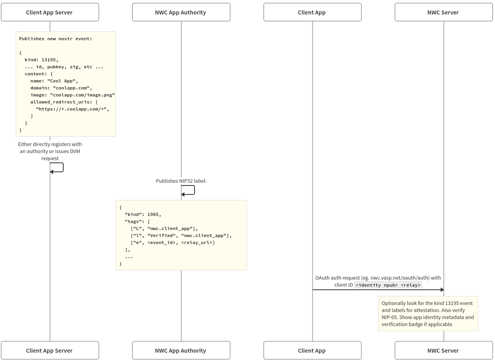

# UMADE-01: UMA Auth: NWC + OAuth

UMA Auth is an extension of UMA which allows users to connect their UMA-enabled wallets to third-party applications.
This allows users to send and receive payments in the currency of their choice from within their favorite apps. It also
allows application developers to easily add payment functionality to their apps without needing to worry about the
underlying payment infrastructure.

This is made possible by the [Nostr Wallet Connect (NWC)](https://nwc.dev) protocol, which was designed to connect
Lightning-enabled wallets to third-party applications via [Nostr](https://nostr.com/). UMA auth extends NWC to simplify
the UX of connecting a wallet (using OAuth 2.0), and add cross-currency payments to allow users and applications to
transact in any currency they choose.

## Protocol Overview

From a protocol perspective, UMA Auth is a combination of the UMA protocol, OAuth 2.0, and the NWC protocol.


When a user wants to connect their UMA wallet to a third-party application:

1. The client app starts a standard OAuth 2.0 flow by redirecting the user to the UMA provider's authorization endpoint.
2. The UMA provider authenticates the user and asks for their permission to connect to the client app.
3. The UMA provider redirects the user back to the client app with an authorization code as usual in OAuth 2.0.
4. The client app exchanges the authorization code for an NWC connection string and refresh token.
5. The client app uses the NWC connection string to connect to the user's UMA wallet and start sending and receiving payments.
6. The client app uses the refresh token to get a new NWC connection string when the old one expires.

This process utilizes the battle-tested security and familiar UX of OAuth to establish a connection, with the simplicity
and flexibility of Nostr Wallet Connect for sending and receiving payments. Users can configure granular permissions and
budgets for each connected app, and revoke access at any time.

## Client App Registration

Traditionally, OAuth 2.0 requires client apps to register with the authorization server before they can request access
to user resources. Because NWC and UMA Auth connect client apps to arbitrary wallet services, it is not feasible for
every client app to register with every wallet service or UMA provider. Instead, the Nostr protocol is used for
decentralized client app registration.



When an application wants to use UMA Auth, it generates a single Nostr keypair that identifies the application. This

When an application wants to use UMA Auth, it generates a single Nostr keypair that indentifies the appplication. This
is called the "identity keypair". An application should have a single identity keypair that represents the application
as opposed to one for each app instance or user. The identity keypair is used to sign and publish a nostr registration
message (kind 13195) that contains the application's name, logo, allowed redirect URLs, etc. For example:

```jsonc
{
  "kind": 13195,
  // ... other fields
  "content": {
    "name": "Zappy Bird",
    "nip05": "_@zappybird.com",
    "image": "https://zappybird.com/logo.png",
    "allowed_redirect_uris": ["https://zappybird.com/auth/callback", "zappybird://auth/callback"],
  }
}
```

This event contains the content that would show up on a permissions page: app name, image, and a
[NIP-05-verified](https://github.com/nostr-protocol/nips/blob/master/05.md) address. Critically, it also contains a list
of allowed redirect URIs. This list is used to ensure that apps that claim to be Zappy Bird can only redirect to the
URIs that Zappy Bird has claimed. This prevents phishing attacks where an attacker could register an app with the same
name and logo as Zappy Bird and redirect users to a malicious site.

The client ID used for the OAuth flow is `<identity npub> <relay>`, where `<identity npub>` is the public key of the
identity keypair (in bech32 "npub" format) and `<relay>` is the Nostr relay where the client app published the 13195
event. The client ID is used by the VASP to look up the client app's registration event, show the user the app's metadata,
and limit the redirect URIs to those listed in the event.

### Client App Verification

Once the client app has published this event, it can be optionally verified by an authority via a
[NIP-32 label event](https://github.com/nostr-protocol/nips/blob/master/32.md).
For example, if "Ol' Reliable Fintech" is a known trusted verifier of client applications, VASPs could look for a label
event from them for the given 13195 event and show the user a “verified” badge. The VASP can also check the listed domain
for NIP-05 verification. In order to be verified by a trusted authority, the client application can manually register
with an authority. As a future optimization, they can issue a
[NIP-89 Data Vending Machine](https://github.com/nostr-protocol/nips/blob/master/90.md) request to optionally pay
anyone claiming to be an authority to issue labels verifying their app identity event. This can be automatic,
asynchronous, and fully decentralized.

For more details on the Nostr protocol for client app registration, see
[NIP-68](https://github.com/nostr-protocol/nips/pull/1383), which was designed specifically for this purpose.

## OAuth Connection Flow

The OAuth connection flow is a standard OAuth 2.0 flow with a few UMA-specific parameters and details. Client applications
first need to discover the UMA VASP's OAuth endpoints and supported features. This is done by fetching the VASP's UMA
configuration document from `/.well-known/uma-configuration` on the VASP's domain. See [UMAD-10](/umad-10-configuration-document.md)
for more details. The configuration document should contain the following fields relevant to UMA Auth:

- `authorization_endpoint`: The URL of the VASP's authorization endpoint. This is where the client application should send
  the user to authenticate and authorize the client application to access their wallet.
- `token_endpoint`: The URL of the VASP's token endpoint. This is where the client application exchanges an authorization
    code for an access token (a new NWC Connection), and where the client application can refresh an access token.
- `nwc_commands_supported`: An array of strings representing the NWC commands that the VASP supports. This should be an
    array of strings, where each string is a valid NWC command name.
- `grant_types_supported`: An array of strings representing the OAuth grant types that the VASP supports. For now, in
    most cases, this should just be `["authorization_code"]`.
- `code_challenge_methods_supported`: An array of strings representing the PKCE code challenge methods that the VASP
    supports. For now, in most cases, this should just be `["S256"]`.
- `connection_management_endpoint`: The URL of the VASP's connection management endpoint. This is where the user can
    create, update, and delete NWC Connections.
- `revocation_endpoint`: The URL of the VASP's revocation endpoint. This is where the client application can revoke an
    access token (NWC Connection).

As with any OAuth 2.0 flow, the client application should start the auth flow by redirect the user to the VASP's
authorization endpoint with the following query parameters:

### Auth Request URL Params

An example URL for the auth request might look like this:

```url
<authorization_endpoint>?client_id=npub37fd9…%3Awss%3A%2F%2Fmyrelay.info&redirect_uri=https%3A%2F%2Fexample.com&response_type=code&code_challenge=a43f6ed&code_challenge_method=S256&state=foobar&required_commands=pay_invoice%20make_invoice%20lookup_invoice&optional_commands=list_transactions&budget=10.USD%2Fmonthly&expires_at=1717964120
```

OAuth params above are listed first, followed by UMA-specific params.

Standard OAuth Params:

- `client_id` in the format `identity_npub identity_relay`: This will be used to lookup the client app as described above
in the client app registration section.
- `redirect_uri`: The redirect URI which will receive callback data from the wallet service on successful authentication.
It will get back the auth code that can be exchanged for a token. If there was a kind-13195 nostr event as described above,
the wallet will validate this redirect URI against declared allowed patterns.
- `response_type=code`: Indicates that the “Authorization Code” flow will be used.
- `code_challenge` and `code_challenge_method`: The PKCE exchange details.
- `state`: Optional oauth state param for CSRF and state restoration.

Extra NWC params:

- required_commands: A space-separated list of commands that the app requires from the wallet. The wallet MUST NOT connect
if it does not support all of these permissions, or if the user does not grant one of them.
- optional_commands: (optional) A space-separated list of commands that the wallet can enable to add additional functionality.
The wallet MAY ignore these.
- budget: (optional) Requested budget in the format `<max_amount>.<currency>/<period>`. If the `.<currency>` is omitted,
satoshis are assumed. If `/<period>` is omitted, it’s a budget forever. For example, a budget string of “1000” would mean
that this connection can only ever be used for a maximum of 1000 satoshis sent.
- expires_at: (optional) connection cannot be used after this date. Unix timestamp in seconds.

### Authorization Response

The auth request's redirect follows the standard OAuth 2.0 flow. Using the `redirect_uri` param, the wallet will redirect
to the client application with either:

`?error=ACCESS_DENIED&error_description=Some%20short%20message`
(see
[here](https://www.oauth.com/oauth2-servers/authorization/the-authorization-response/#:~:text=longer%20be%20used.-,Error%20Response,-There%20are%20two)
for full description of errors)

or

`?code=g0ZGZmNjVmOWI&state=dkZmYxMzE2`

If the user denies the request, the wallet will redirect with an error. If the user accepts, and there are no other errors,
the wallet will redirect with the auth code and state.

### Token Exchange

The client application can then exchange the auth code for an access token and refresh token by sending a POST request to
the VASP's `token_endpoint` as specified in the `uma-configuration` document. An example token request might look like this:

```http
POST /oauth/token HTTP/1.1
Host: https://umanwc.examplevasp.com
 
grant_type=authorization_code
&code=xxxxxxxxxxx
&redirect_uri=https://example-app.com/redirect
&code_verifier=Th7UHJdLswIYQxwSg29DbK1a_d9o41uNMTRmuH0PM8zyoMAQ
&client_id=npub16f80k0f4vg0nnlepxrqxeh81slyzst2d wss://myrelay.info
```

The `redirect_uri` and `client_id` must match the values used in the auth request. The `code_verifier` is the PKCE code
verifier matching the `code_challenge` used in the auth request. If successful, the VASP will respond as follows:

```http
HTTP/1.1 200 OK
Content-Type: application/json
Cache-Control: no-store
 
{
  "access_token":"b9d11fe05e266fe7389fdf1359211e7859656a7898d64f3066092156de109b31",
  "token_type":"Bearer",
  "expires_in":86400,
  "refresh_token":"IwOGYzYTlmM2YxOTQ5MGE3YmNmMDFkNTDk",
  "nwc_connection_uri": 
"nostr+walletconnect://a421a5e2a615eff3b797be5318e4e187d24b100748cfaa8d0b390ce659906d8f?relay=wss://relay.getalby.com/v1&secret=b9d11fe05e266fe7389fdf1359211e7859656a7898d64f3066092156de109b31&lud16=$bob@examplevasp.com"
  "commands": ["pay_invoice", "fetch_quote", "execute_quote", "make_invoice", "pay_to_address"],
  "budget": "100.USD/month",
  "nwc_expires_at": 1721796505
}
```

The standard OAuth token response fields are included here along with some details about the established NWC connection.
The client can use the `nwc_connection_uri` to make requests to the wallet. Note that the `access_token` is the
`secret` in the `nwc_connection_uri`. This implies that the `nwc_connection_uri` expires when the `access_token` expires
(denoted by `expires_in`). This is usually fairly short (~2 hours), but can be configured by the VASP. Client apps should
store the `refresh_token` securely and use it to get a new `access_token` when the old one expires.

### Refreshing Tokens

Token refresh works exactly as in OAuth 2.0. The client app sends a POST request to the VASP's `token_endpoint` as follows:

```http
POST /oauth/token HTTP/1.1
Host: https://nwc.uma.jeremykle.in
 
grant_type=refresh_token
&refresh_token=IwOGYzYTlmM2YxOTQ5MGE3YmNmMDFkNTVk
&client_id=npub16f80k0f4vg0nnlepxrqxeh81slyzst2d:wss://myrelay.info
```

The VASP will respond with the same format as the initial access token request. The client app should store the new
`access_token` and `refresh_token` and use the new `nwc_connection_uri` to make requests to the wallet.

## NWC Requests

Requests should be made to the `nwc_connection_uri` provided in the token response. For details on the NWC protocol, see
[NIP-47](https://github.com/nostr-protocol/nips/blob/master/47.md).

### Pending NIP PRs Adopted in UMA Auth

UMA Auth propoeses some new NWC commands to support cross-currency payments and client app registration. These changes
are proposed in the following NIPs PRs:

- [NIP-68: Client App Registration](https://github.com/nostr-protocol/nips/pull/1383)
- [Cross-Currency Payments](https://github.com/nostr-protocol/nips/pull/1353)
- [Add get_budget command](https://github.com/nostr-protocol/nips/pull/1504)

#### Budgets

Budgets can be set per-connection to limit the amount of money that can be sent by a client application in a given period.
The budget granted is specified in the `budget` field of the token response. The format is `<max_amount>.<currency>/<period>`.

Client applications can also fetch the currently available budget for a connection by sending a `get_budget` command to the
wallet. The wallet will respond with the current budget details as follows:

```json
{
    "result_type": "get_budget",
    "result": {
        "remaining_budget_msats": 10000,
        "total_budget_msats": 100000,
        "renews_at": 1693876973, // timestamp in seconds since epoch, optional. If not provided, the budget does not renew.
        "renewal_period": "monthly", // daily|weekly|monthly|yearly|never
        "currency": {
            "name": "US Dollar",
            "code": "USD",
            "symbol": "$",
            "decimals": 2,
            "total_budget": 1000,
            "remaining_budget": 100,
        }
    }
}
```

#### NIP-44 Encryption

At the time of writing, NWC uses [NIP-04](https://github.com/nostr-protocol/nips/blob/master/04.md) for encryption and
decryption of messages. This encryption protocol has been deprecated in favor of
[NIP-44](https://github.com/nostr-protocol/nips/blob/master/44.md), which is known to be more secure, and has been
thoroughly audited by security experts. As a result, any NWC connection established via the UMA Auth OAuth flow will
use NIP-44 for encryption and decryption of messages.

## Additional Resources

- [Full Documentation and Guides](https://docs.uma.me/uma-auth/introduction)
- Client SDKs:
  - [Web/React](https://github.com/uma-universal-money-address/uma-js-sdk)
  - [Android](https://github.com/uma-universal-money-address/uma-auth-client-android)
  - (iOS SDK coming soon)
- [VASP Open API Schema](https://github.com/uma-universal-money-address/uma-auth-api)
- [UMA NWC Docker Image](https://github.com/uma-universal-money-address/uma-nwc-server). See the documentation for
  more info.
- [UMA Auth CLI tool](https://github.com/uma-universal-money-address/uma-auth-cli)
